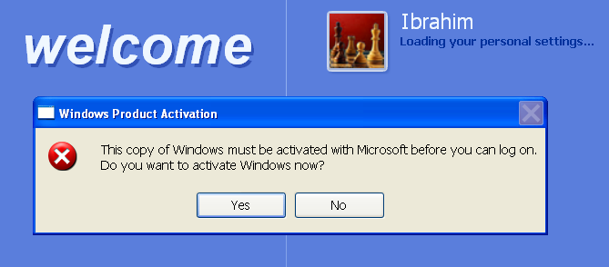

# WindowsXp

activate all versions of windows xp without needing a product key 🗝

Windows XP is my second favorite operator system. It's iconic and compatibility and is till this time the windows xp is still be used in manufacturing,healthcare,military, banking,and you name it.

# How to activated it without product key
Simply in the desktop.

1. Click on the Start Muenu.
2. Select **`Run`**.
3. In the Run Dialog box, type **`regedit`**.
4. press Enter or click **`OK`**.

it should be like this picture🖼 

This will open the Registry Editor where you can view and modify system settings.

Now to find the "WPAEvents" folder Navigate to the following path:
 
---------------------------------------------------{ Registry Editor }----------------------------------------------------------
  
    📂 HKEY_LOCAL_MACHINE
                         ↳📂\SOFTWARE
                                     ↳📂\Microsoft
                                                  ↳📂\Windows NT
                                                                ↳📂\CurrentVersion
                                                                                  ↳📂\WPAEvents

In the left pane of the Registry Editor expand each folder until you reach "WPAEvents" once you're there you'll see the "WPAEvents"folder in the left pane **`click`** on the folder.

This folder is related to windows product activation "WPA". It contains information about the activation status of the operating system theat how we can affect the activation state.

You'll see the "OOBETimer" **`click it`**. Now you entered to the "edit binary value". It's a hexadecimal value used to track the system activation status.

**`Delete`** the old "value data" and copy the "value data" in the picture below. 

Start with **`FF`** in the Value data thin **`click OK`**.

Now **`Right-click`** the "WPAEvents" folder thin **`click Permissions...`**. It'll open up the "Permissions For WPAEvents".

In the "Permissions For WPAEvents" is "security group or user names" **`click SYSTEM`** thin "Permissions For SYSTEM". Deny Full CONTROL system and Read to do wit. `check the two boxes to Deny`✅ like the pictures below.

And **`click OK`**.

 # Congratulations you're Windows Xp is activated ✨

 

# ⚠ Important to now
If you have a problem logon because of this copy of windows must be activated with Microsoft but you already activated windows.

🔧The Fix in this link 🔗 

